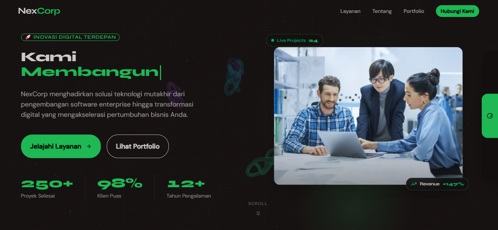
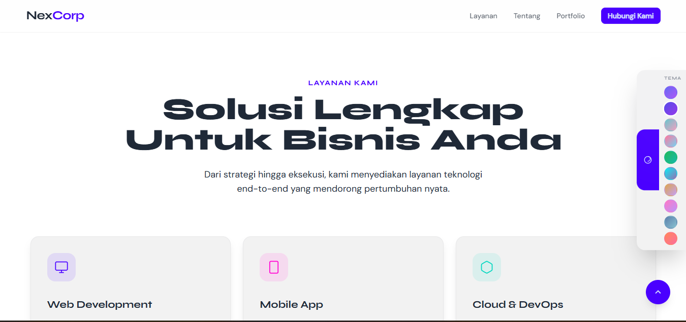
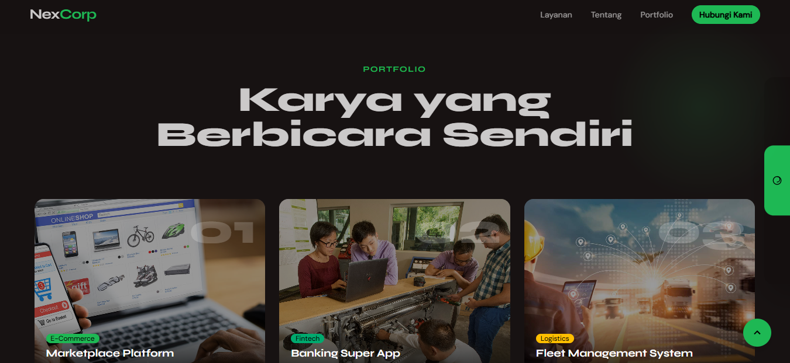
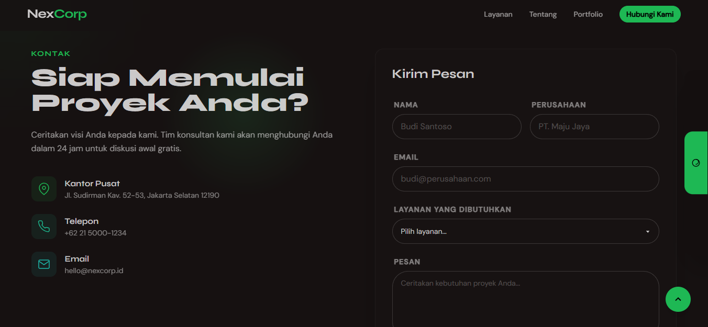

# NexCorp — Digital Agency Landing Page

A modern digital agency landing page built with **Next.js 14**, **Tailwind CSS v3**, and **DaisyUI v4**. Features a Three.js animated hero, 10 switchable themes, smooth scroll animations, and a fully responsive layout.

---

## Screenshots

### Hero & Navbar

> Sticky navbar with scroll blur effect, full-screen mobile menu overlay, and a hero section with an animated Three.js particle canvas and typing text effect.

---

### Services, About & Theme Switcher

> Six service cards with hover glow effects, an About section with animated stat counters (250+ projects, 86+ clients, 12+ years, 98% satisfaction), and a slide-out theme switcher panel.

---

### Portfolio & Testimonials

> Five portfolio project cards across multiple industries, followed by a testimonials section with client reviews.

---

### Contact & Footer

> Contact section with a form and office info, plus a footer with navigation links, social icons, and legal pages.

---

## Features

- **10 Themes** — Dark, Light, Cupcake, Cyberpunk, Forest, Aqua, Luxury, Dracula, Nord, Sunset
- **Three.js Hero** — Animated particle canvas rendered on the hero background
- **Typing Text Effect** — Animated rotating headline text
- **Cursor Glow** — Smooth cursor follow glow effect
- **Marquee** — Auto-scrolling client logo strip
- **Scroll Reveal Animations** — IntersectionObserver-based entrance animations
- **Animated Stat Counters** — Numbers count up on scroll into view
- **Card Tilt Effect** — Mouse-tracking 3D tilt on cards
- **Responsive Design** — Mobile-first with full-screen mobile nav overlay
- **Legal Pages** — Privacy Policy, Terms & Conditions, and Sitemap pages included

---

## Getting Started

```bash
# 1. Install dependencies
npm install

# 2. Run the development server
npm run dev

# 3. Open in browser
http://localhost:3000
```

---

## Tech Stack

| Technology   | Version  | Description                          |
|--------------|----------|--------------------------------------|
| Next.js      | ^14.2.0  | React framework with App Router      |
| React        | ^18.3.0  | UI library                           |
| Tailwind CSS | ^3.4.0   | Utility-first CSS framework          |
| DaisyUI      | 4.12.10  | Tailwind-based UI components via CDN |
| Three.js     | ^0.128.0 | 3D particle animation on hero canvas |
| TypeScript   | ^5.0.0   | Type-safe JavaScript                 |

---

## Project Structure

```
nexcorp/
├── app/
│   ├── kebijakan-privasi/
│   │   └── page.tsx          # Privacy policy page
│   ├── sitemap-page/
│   │   └── page.tsx          # Sitemap page
│   ├── syarat-ketentuan/
│   │   └── page.tsx          # Terms & conditions page
│   ├── globals.css            # Global styles + Tailwind directives
│   ├── layout.tsx             # Root layout with ThemeProvider & metadata
│   └── page.tsx               # Home page — composes all sections
├── components/
│   ├── Navbar.tsx             # Sticky navbar with scroll blur
│   ├── MobileMenu.tsx         # Full-screen mobile nav overlay
│   ├── MobileMenuTrigger.tsx  # Hamburger trigger button
│   ├── ThemePanel.tsx         # Slide-out theme switcher (10 themes)
│   ├── CursorGlow.tsx         # Cursor follow glow effect
│   ├── Hero.tsx               # Hero section + Three.js particle canvas
│   ├── TypingText.tsx         # Animated typing/rotating headline
│   ├── Marquee.tsx            # Auto-scrolling client logos
│   ├── Services.tsx           # 6 service cards with hover glow
│   ├── About.tsx              # About section + animated stat counters
│   ├── Portfolio.tsx          # 5 portfolio project cards
│   ├── Testimonials.tsx       # Client testimonial cards
│   ├── Contact.tsx            # Contact info + form
│   ├── Footer.tsx             # Links + social icons
│   └── Animations.tsx         # Client-side: scroll reveal, counters, tilt
├── hooks/
│   ├── useTheme.tsx           # Theme context + fast switching via rAF
│   └── useReveal.ts           # IntersectionObserver reveal + counter hooks
├── screenshots/               # Website screenshots
└── tailwind.config.js         # Tailwind configuration
```

---

## Sections

| Section       | Description                                              |
|---------------|----------------------------------------------------------|
| Hero          | Particle animation background, typing headline, CTA     |
| Marquee       | Auto-scrolling strip of client/partner logos            |
| Services      | Web Dev, Mobile App, Cloud & DevOps, UI/UX, AI, Security|
| About         | Company story + animated counters (250+ projects, etc.) |
| Portfolio     | Marketplace, Banking App, Fleet, Hospital, LMS projects |
| Testimonials  | Client reviews with ratings                             |
| Contact       | Contact form + office address and social links          |
| Footer        | Site links, legal pages, social icons                   |

---

## Available Themes

| Theme      | Style         |
|------------|---------------|
| dark       | Default dark  |
| light      | Clean light   |
| cupcake    | Soft pastel   |
| cyberpunk  | Neon yellow   |
| forest     | Deep green    |
| aqua       | Ocean blue    |
| luxury     | Gold & black  |
| dracula    | Purple dark   |
| nord       | Arctic blue   |
| sunset     | Warm orange   |

---

Built by **[Rayn](https://rayn.web.id)** — rayn.web.id
